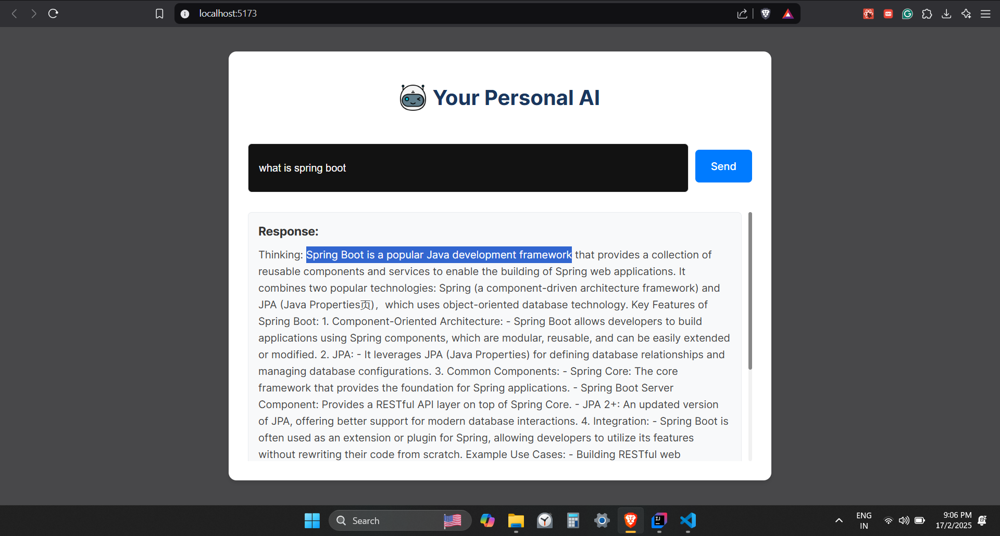

# Personal AI (Offline - No Internet Needed)

This is a personal AI that **works entirely offline**, using **Spring AI** for the backend and **React** for the frontend. The AI leverages the **DeepSeek R1** model and requires **Ollama** for model management.

<br>

## How it looks like:


<br>


<br>

## Tech:

- Backend: SpringAI framework, deepkseek r1 model, ollama
- Frontend: React, Vite


<br>

## To quick start:

### Prerequisites:

- **Ollama** ([Download here](https://ollama.ai))
- **Node.js** (for frontend development)
- **Java & Spring Boot** (for backend development)

<br>

## Setup Instructions:

### 1. Install and Configure Ollama:

1. Download and install [Ollama](https://ollama.ai).
2. Open a terminal and pull the DeepSeek R1 model version according to your system configuration:
   ```sh
   ollama pull deepseek-r1:7b # According to your system config
   ```
3. Verify the installation by listing available models:
   ```sh
   ollama list
   ```
   Ensure `deepseek-r1` appears in the list.

<br>

### 2. Clone the Repository:

```sh
git clone <your-repo-url>
cd <your-repo-folder>
```

<br>

### 3. Start the Backend Server:

<br>

### 4. Start the Frontend:

1. Install dependencies:
   ```sh
   npm install
   ```
2. Start the frontend server:
   ```sh
   npm run dev
   ```

<br>

## Usage:

Once both backend and frontend servers are running, open your browser and navigate to `http://localhost:3000` to interact with your offline AI.

<br>
